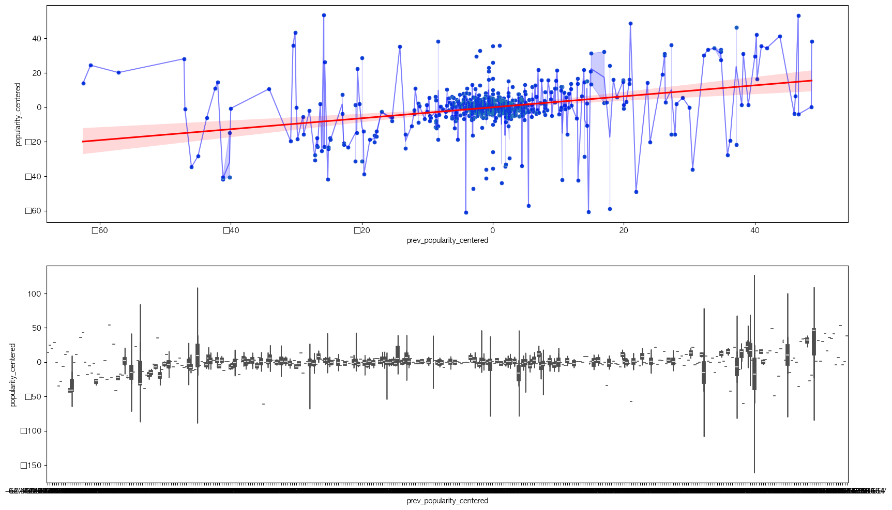

# Spotify-Popularity-Prediction-Project     
## 1. Project Overview
This project began with the question: **"Does an artist's previous success guarantee the success of their next track?"**

Using the Spotify Web API, I collected music data from 2023 to 2025 (including projected releases) to analyze time-series trends by artist. Specifically, I applied statistical techniques and machine learning regression models to identify the pure performance relationship between tracks (Tracks) after removing the artist's inherent awareness (Artist Fixed Effect).

**🎯 Key Objectives**
- **Web Scraping & API Handling**: Large-scale collection of track and artist metadata using the Spotify API.
- **Feature Engineering**: Creation of Lag features and removal of bias through Artist Mean Centering.
- **Statistical Analysis**: Correlation analysis (Pearson, Spearman) and OLS Regression.
- **Predictive Modeling**: Building a linear regression model to predict a new track's performance based on previous track metrics (evaluated via RMSE).

## 2. Tech Stack & Tools
**Language**: Python 3.14
**Data Collection**: `spotipy` (Spotify Web API Wrapper)
**Data Processing**: `pandas`, `numpy`
**Visualization**: `seaborn`, `matplotlib`
**Statistics & ML**: `scikit-learn` (LinearRegression, GroupKFold), statsmodels (OLS), scipy

## 3. Data Collection & Preprocessing
### 3.1 Data Acquisition
Using the `spotipy` library, I collected information on tracks released between 2023 and 2025.
- **Track Data**: Release date, Popularity, Track ID
- **Artist Data**: Followers, Genre, Artist Popularity

### 3.2 Preprocessing & Feature Engineering
To improve data reliability, the following preprocessing steps were performed:
- **Handling Missing Values & Type Conversion**: Standardized release date formats and handled NaN data.
- **Lag Feature Generation**: Created a `prev_track_popularity` variable by mapping the popularity of the immediately preceding track to the current data row for each artist.
- **Mean Centering**: Raw popularity tends to be heavily influenced by an artist's "stature" (fame). To correct for this, I created a `popularity_centered` variable by calculating (Individual Track Popularity - Artist Average Popularity). This eliminates the fame factor, allowing for a comparative analysis of the relative performance of the songs themselves.

## 4. Exploratory Data Analysis (EDA)
I analyzed the correlation between the popularity of the previous track and the current track to understand overall trends.

> **Figure 1.** Scatter plot before removing the Artist Fixed Effect. A very high correlation of $r=0.84$ is observed, but this result includes the bias of the artist's existing popularity.

### 4.1 De-biasing: Mean Centering
To prevent distortion caused by differences in artist stature, I centered the average popularity per artist to 0 to create the `Relative Popularity` variable.

> **Figure 2.** Regression results after removing the artist effect. The correlation coefficient dropped to $r=0.32$, but a significant positive correlation (upward trend) is still observed. This suggests that the success of a previous work provides positive Momentum to the subsequent work.

## 5. Modeling & Evaluation
I built a linear regression model to predict `popularity_centered` (Relative Popularity).

**Validation Strategy: GroupKFold (n=5)**
- To prevent **Data Leakage**—where songs from the same artist appear in both the training and test sets—I split the data by artist for validation.

**Baselines:**
- Baseline 0: Assumes all predictions are 0 (the average).
- Baseline 1: Assumes the previous track's performance is maintained exactly.

## 5. Modeling Results
I constructed a Linear Regression model reflecting time-series characteristics (Lag Regression) and performed 5-Fold GroupKFold cross-validation.

| Model Type | Description | RMSE (Lower is Better) | Performance Gain |
| :--- | :--- | :---: | :---: |
| **Baseline (0)** | Assumes all predictions are 0 (Mean) | 11.846 | - |
| **Baseline (Prev)** | Assumes previous performance is maintained | 11.537 | +2.6% |
| **Lag Regression** | **Uses previous track performance as a variable (Ours)** | **10.083** | **+14.9%** |
| **Extended Model** | Adds Genre & Follower count variables | 10.120 | +14.6% |

* **Interpretation:**
- The Lag Regression model recorded an **RMSE of 10.083**, showing a **~15% performance improvement** compared to the Baseline models ($RMSE 11.5–11.8$).

- Interestingly, the model focusing solely on the **"performance of the previous song"** performed better than or similar to the Extended Model, which included static variables like Genre or Followers. This proves that Momentum is the most powerful variable in short-term prediction.

## 6. Conclusion & Insights
- **Momentum Exists**: Even after excluding the artist's baseline fame, the success of a previous work has a positive impact on the performance of the next work.
- **Data Integrity**: Confirmed that grouping by artist and handling Lag data are critical for model performance when analyzing time-series data.
- **Limitations**: The inability to reflect external factors in the streaming market (marketing, TikTok virality, etc.) remains a task for future research.
